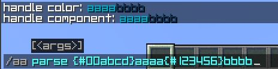
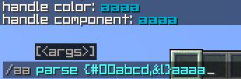

### AdvancedAnnouncement: Automatically announcement.
[简体中文](README_zh.md)

[MCBBS Page(China)](https://www.mcbbs.net/forum.php?mod=viewthread&tid=1420798&page=1&extra=#pid27960648)
[SPIGOT Page](https://www.spigotmc.org/resources/advancedannouncement-automatically-announce-new-types-added.107574/)


## Contents
+ [Announcement types table](#Announcement-types-table)
+ [Commands](#Command)
+ [All available placeholders](#all-available-placeholders)
+ [Usage of command aa parse](#usage-of-command-aa-parse)
+ [Create an announcement](#create-an-announcement)
+ [Use RGB color code](#Use-RGB-color-code)
+ [Usage of command '/aa parse'](#usage-of-command-aa-parse)
+ [Image view](#image-view)
    + [CHAT type](#CHAT-type)
    + [ACTION_BAR type](#ACTION_BAR-type)
    + [BOSS_BAR type](#BOSS_BAR-type)
    + [TITLE type](#TITLE-type)
    + [MULTIPLE_LINE_BOSS_BAR type (1.0.2+)](#MULTIPLE_LINE_BOSS_BAR-type)
+ [Configs](#configs)

## Announcement types table
All available announcements are as below:

| announcement type | instruction |
| ------------ | --- |
| CHAT         | this announcement type will be sent to chat box |
| ACTION_BAR   | this announcement type will be sent to player's action-bar |
| BOSS_BAR     | this announcement type will be displayed by a boss bar |
| TITLE        | this announcement type will be sent through a title |
| PRE_ANNOUNCE | this announcement type will be sent to players at any time that you want |
|MULTIPLE_LINE_BOSS_BAR | this announcement type will be displayed by multiple boss bars. (Since 1.0.2)|

## Command
| Command | permission | description |
|---|---|---|
|/aa help     | -------------------- | show plugin help        |
|/aa start    | aa.command.start     | start announce task    |
|/aa stop     | aa.command.stop      | stop announce task     |
|/aa broadcast| aa.command.broadcast | broadcast an announcement     |
|/aa display  | aa.command.display   | display an announcement to you  |
|/aa list     | aa.command.list      | list all loaded announcements |
|/aa parse    | aa.command.parse     | parse a string with placeholders    |
|/aa reload   | aa.command.reload    | reload this plugin  |

## All available placeholders
| name | description | you can use it on |
| ------- | --- | --- |
| {rainbow} | gradient rainbow text | all |
| {#RRGGBB[,&lt;arg1&gt;,&lt;arg2&gt;,...]} | RGB color text | all |
| {#RRGGBB->#GGBBRR[,&lt;arg1&gt;,&lt;arg2&gt;,...]}| gradient text | all |
| {delay:&lt;double&gt;} | the delay time to next text | 1. ACTION_BAR <br/> 2. BOSS_BAR |
| {stay:&lt;double&gt;} | the stay time of text | 1. ACTION_BAR <br/> 2. BOSS_BAR |
| {color:&lt;PINK&#124;BLUE&#124;GREEN&#124;RED&#124;YELLOW&#124;PURPLE&#124;WHITE&gt;} | the color of the boss bar | 1. ACTION_BAR <br/> 2. BOSS_BAR <br/> 3. MULTIPLE_LINE_BOSS_BAR |
| {update:&lt;double&gt;} | the update time of the boss bar's title | 1. BOSS_BAR <br/> 2. MULTIPLE_LINE_BOSS_BAR |
| {progress:&lt;true&#124;false&gt;} | show the progressing animation | 1. BOSS_BAR <br/> 2. MULTIPLE_LINE_BOSS_BAR |
| {segment:&lt;6&#124;10&#124;12&#124;20&gt;} | the segments of the boss bar | 1. BOSS_BAR <br/> 2. MULTIPLE_LINE_BOSS_BAR |

## Usage of command '/aa parse'


## Create an announcement
To create an announcement, you should turn to `announcements.yml` and find `announcements` section.
There is an example of CHAT type announcement.

```yaml
# the announcement name, not limited but DO NOT HAVE DUPLICATED NAME.
annName:
  # announcement type, all the types are in the table of "Announcement types table" above.
  type: CHAT
  # announce content
  content:
    - 'this announcement will be sent to chat box.'
    - 'multiple line supported'
```

> Note: 
> Only required options are listed in the example, see [announcements.yml](docs/announcements.yml_CN.md) for the rest of the details.

## Use RGB color code
As the introduction said, AdvancedAnnouncement is supported to use RGB color code(your Minecraft server must be 1.16 or above).

> Notice: <br/>
> PlaceholderAPI supported. <br/>
> If you enabled config 'Console-broadCast', placeholder will directly display ITS RAW TEXT<br/>
> (if this placeholder must be parsed with a player.)<br/>
> <br/>
> If your server version is lower than 1.16, then the legacy color code is recommended.<br/>
> Although the plugin is color compatible with a lower version (it will automatically replace<br/>
> the RGB color with the closest legacy color), we still do not recommend using RGB color code<br/>
> if the server version is lower than 1.16. 

### Common RGB text
format: `{<Color>[,<arg1>,<arg2>,...]}`, <br/>
Where `[,<arg1>,<arg2>,...]` is an optional item that represents whether the text uses bold fonts, italics, and so on
Multiple settings can be set at the same time to achieve different effects

Here is examples:
1. `{#00abcd}aaaa` normal RGB text
  + effect: <br/><br/>
2. `{#00abcd,&l}aaaa{#123456}bbbb` bolded text
  + effect: <br/>
3. `{#00abcd,&l,&n}aaaa` bolded and underlined text
  + effect: <br/>

### Gradient RGB text
Format: `{<Color1>-><Color2>[,<arg1>,<arg2>,...]}`, <br/>
As introduced above,`[,<arg1>,<arg2>,...]` is an optional item that represents whether the text uses bold fonts, italics, and so on
Multiple settings can be set at the same time to achieve different effects

Here is an example:
  1. `{#00abcd->#123456}123456789987654321`
    + effect: <br/> 

### Rainbow text
Format `{rainbow[,<arg1>,<arg2>,...]}`, <br/>
As introduced above,`[,<arg1>,<arg2>,...]` is an optional item that represents whether the text uses bold fonts, italics, and so on
Multiple settings can be set at the same time to achieve different effects

Here is an example:
1. `{rainbow}123456789987654321`
  + effect: <br/> 

## Image view

### CHAT type
  

### ACTION_BAR type
  

### BOSS_BAR type
  

### TITLE type
  

### MULTIPLE_LINE_BOSS_BAR type
  This type has been added **_since the version of 1.0.2_**
  

### PRE_ANNOUNCE type
  this type will be displayed using the 5 types above.


## configs
Due to the huge amount of documentation, please move to the path under the corresponding file to view.

+ [config.yml](docs/config.yml_EN.md)
+ [announcements.yml](docs/announcements.yml_EN.md)
+ [components.yml](docs/components.yml_EN.md)