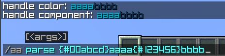
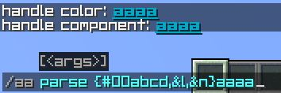
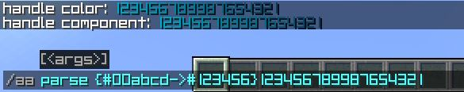

### AdvancedAnnouncement: 更高级的自动公告

[Read In English](README.md)

[MCBBS 发布页](https://www.mcbbs.net/forum.php?mod=viewthread&tid=1420798&page=1&extra=#pid27960648)

[SPIGOT 发布页](https://www.spigotmc.org/resources/advancedannouncement-automatically-announce-new-types-added.107574/)


## 目录
+ [公告类型表](#公告类型表)
+ [指令](#指令)
+ [所有可用的占位符表](#所有可用的占位符表)
+ [使用 BungeeCord 版本插件](#使用-BungeeCord-版本插件)
+ [使用 '/aa parse' 解析字符串](#使用-'/aa-parse'-解析字符串)
+ [创建一个公告](#创建公告)
  + [公告中的 必填项目](#公告中的-**_必填项目_**)
  + [公告中的 选填项目](#公告中的-**_选填项目_**)
  + [公告延迟时间填写格式](#公告延迟时间填写格式)
+ [使用 RGB 颜色](#使用-RGB-颜色代码)
+ [图片效果](#图片效果)
  + [CHAT 类型](#CHAT-类型)
  + [ACTION_BAR 类型](#ACTION_BAR-类型)
  + [BOSS_BAR 类型](#BOSS_BAR-类型)
  + [TITLE 类型](#TITLE-类型)
  + [MULTIPLE_LINE_BOSS_BAR 类型(自 1.0.2 版本起)](#MULTIPLE_LINE_BOSS_BAR-类型)
+ [配置](#配置)

## 公告类型表
目前的公告类型如下:

| 公告类型       | 说明 | 备注 |
| ------------ | --- | --- |
| CHAT         | 公告会被发送到聊天栏上 | |
| ACTION_BAR   | 公告会被发送到玩家的物品栏上方 | |
| BOSS_BAR     | 公告会以 BOSS 栏的方式显示在玩家屏幕正上方 | |
| TITLE        | 公告会以标题的形式发送到玩家的屏幕中间 | |
| PRE_ANNOUNCE | 公告会在指定时间到达时被发送出去 | 由于不具备什么实用性功能从 v1.2.1-beta 中已经被移除 |
| MULTIPLE_LINE_BOSS_BAR | 该公告会以多行 BOSS 栏的形式发送到玩家屏幕上方. (自 1.0.2 版本起)| |

## 指令
|指令|权限|描述|
|---|---|---|
|/aa help     | -------------------- | 显示帮助        |
|/aa start    | aa.command.start     | 开始广播公告     |
|/aa stop     | aa.command.stop      | 停止广播公告     |
|/aa broadcast| aa.command.broadcast | 广播一个公告     |
|/aa display  | aa.command.display   | 向你展示一个公告  |
|/aa list     | aa.command.list      | 列出所有加载的公告 |
|/aa parse    | aa.command.parse     | 解析一个字符串    |
|/aa reload   | aa.command.reload    | 重新加载插件  |

## 所有可用的占位符表
| 占位符名称| 描述 | 哪些公告可以使用 |
| ------- | --- | --- |
| {rainbow} | 彩虹渐变文本占位符 | 所有类型 |
| {#RRGGBB[,&lt;arg1&gt;,&lt;arg2&gt;,...]} | RGB 文本颜色占位符 | 所有类型 |
| {#RRGGBB->#GGBBRR[,&lt;arg1&gt;,&lt;arg2&gt;,...]}| 渐变色文本占位符| 所有类型|
| {delay:&lt;double&gt;} | 在显示下一条文本前的间隔时间 | 1. ACTION_BAR <br/> 2. BOSS_BAR |
| {stay:&lt;double&gt;} | 文本的停留时间 | 1. ACTION_BAR <br/> 2. BOSS_BAR |
| {color:&lt;PINK&#124;BLUE&#124;GREEN&#124;RED&#124;YELLOW&#124;PURPLE&#124;WHITE&gt;} | BOSS 栏的颜色 | 1. ACTION_BAR <br/> 2. BOSS_BAR <br/> 3. MULTIPLE_LINE_BOSS_BAR |
| {update:&lt;double&gt;} | BOSS 栏文本的更新时间 | 1. BOSS_BAR <br/> 2. MULTIPLE_LINE_BOSS_BAR |
| {progress:&lt;true&#124;false&gt;} | 显示 BOSS 栏进度动画 | 1. BOSS_BAR <br/> 2. MULTIPLE_LINE_BOSS_BAR |
| {segment:&lt;6&#124;10&#124;12&#124;20&gt;} | BOSS 栏的节段 | 1. BOSS_BAR <br/> 2. MULTIPLE_LINE_BOSS_BAR |

## 使用 BungeeCord 版本插件
### 安装方法
将本插件直接丢到 BungeeCord 下的 plugins 文件夹中即可，**_子服务器无需安装本插件_**

### 变化：
_**本插件的 BungeeCord 版本配置文件**_有以下变化：
`announcements.yml`:
+ 无法使用 `world` 来限制公告被发送的世界，因为这是不可能做到的。
+ 无法使用 `permission` 来限制接收公告的玩家

`components.yml` 内容不变。

> Tips:
> 
> 假如在这之前你已经配置好一份 Bukkit 的 `announcement.yml` 和 `components.yml`，
> 
> 你可以直接将它放置到 BungeeCord 下的插件配置文件夹中。这并不会导致任何报错

其余内容完全相同

## 使用 '/aa parse' 解析字符串
p话少说，直接上图:


## 创建公告
要想创建一个公告，你需要在 `announcements.yml` 中的 `announcements` 块下进行如下配置，
以 CHAT 类型作为示例
```yaml
# 这个公告的名称，在这里不作限制，你只需要保证它不重复即可
annName:
  # 公告的类型
  type: CHAT
  # 公告的内容
  content:
    - '这是一条会被发送到聊天栏里的公告'
    - '可以发送多行'
```
> 注意:
> 示例配置中 **_仅列出必填项目，其余选填内容并没有在此列出_**，选填内容详情请参见 [announcements.yml](docs/announcements.yml_CN.md)

### 公告中的 **_必填项目_**
公告中的必填项目为 `type` 和 `content` 字段，分别表示公告类型和公告内容

### 公告中的 **_选填项目_**
所有选填项目如下:

| 配置项 | 说明 | 可以用在哪些公告上 | 备注 |
| --- | --- | --- | --- |
| delay | 当前公告与下一个公告之间的延迟时间</br>[填写格式见这里](#公告延迟时间填写格式) | 所有公告 | |
| permission | 限制玩家接收到这个公告的权限，没有权限的玩家不会收到这个公告。</br> 如果什么都不写或者去除该项，则表示任何玩家都可收到这个公告 | 所有公告 | |
| worlds | 限制该公告所发送的世界, 如果不配置该项内容，那么公告则会使用默认设置 | 所有公告 | |
| stay | 仅限于多行 Boss 栏公告类型使用，表示该公告的停留时间。 | MULTIPLE_LINE_BOSS_BAR | 从 1.0.2 版本添加 |
| fadeIn | 仅限于 TITLE 类型公告使用，表示 **_标题淡入时间_** | TITLE | |
| stay | 仅限于 TITLE 类型公告使用，表示 **_标题停留时间_** | TITLE | |
| fadeout | 仅限于 TITLE 类型公告使用，表示 **_标题淡出时间_** | TITLE | |
| sub-fadeIn | 仅限于 TITLE 类型公告使用，表示 **_副标题淡入时间_** | TITLE | 从 1.2.0-beta 版本添加 |
| sub-stay | 仅限于 TITLE 类型公告使用，表示 **_副标题停留时间_** | TITLE | 从 1.2.0-beta 版本添加 |
| sub-fadeout | 仅限于 TITLE 类型公告使用，表示 **_副标题淡出时间_** | TITLE | 从 1.2.0-beta 版本添加 |

### 公告延迟时间填写格式
格式为 数字+时间单位，示例内容如下：

|示例内容|所表示的时间|备注|
| --- | --- | --- |
| 60s |  60 秒 | |
| 1min | 1 分钟 | | 
| 1h | 1 小时 (确定吗?)| 由于时间间隔太长从 v1.2.1-beta 中已经被移除 |
| 1d | 1 天 (确定吗?)| 由于时间间隔太长从 v1.2.1-beta 中已经被移除 |
| 1week | 1 周(¿认真的吗)| 由于时间间隔太长从 v1.2.1-beta 中已经被移除 |
| 1month | 1 个月(¿认真的吗)| 由于时间间隔太长从 v1.2.1-beta 中已经被移除 |
| 1year | 1 年 (¿认真的吗)| 由于时间间隔太长从 v1.2.1-beta 中已经被移除 |

## 使用 RGB 颜色代码
正如介绍中所言，AdvancedAnnouncement 支持使用 RGB 颜色代码(1.16+) 来让你的公告拥有更多的颜色！
>Tips: <br/>
> 支持 PlaceholderAPI 变量<br/>
> 如果你启用了 'Console-broadCast', 占位符会直接显示它的原始值(如果这个占位符必须要以一个玩家解析的话)<br/>
> 如果你的服务器版本低于了 1.16, 那么推荐使用原版颜色代码。尽管插件对低版本做了兼容<br/>
> (它会自动将 RGB 颜色替换成与原版最接近的颜色), 仍然不建议在低版本服务器中使用 RGB 颜色代码

### RGB 颜色  
格式：`{<Color>[,<arg1>,<arg2>,...]}`<br/>
其中 `[,<arg1>,<arg2>,...]` 是一个可选择项目，它代表该文本是否使用 **加粗字体** _斜体_ 等等
可同时设置多个来达到不同的效果

下面是示例: 
  1. `{#00abcd}aaaa` 普通的 rgb 文本
     + 效果:<br/><br/>
  2. `{#00abcd,&l}aaaa{#123456}bbbb` 加粗文本
     + 效果: <br/>
  3. `{#00abcd,&l,&n}aaaa` 加粗和下划线的RGB颜色文本
     + 效果: <br/>

### RGB 渐变色
格式 `{<Color1>-><Color2>[,<arg1>,<arg2>,...]}`，<br/>
与上面介绍的一样，`[,<arg1>,<arg2>,...]` 是一个可选择项目，它代表该文本是否使用 **加粗字体** _斜体_ 等等
可同时设置多个来达到不同的效果

下面是示例:
  1. `{#00abcd->#123456}123456789987654321`
     + 效果: <br/> 

### RGB 彩虹渐变色
格式 `{rainbow[,<arg1>,<arg2>,...]}`，<br/>
与上面介绍的一样，`[,<arg1>,<arg2>,...]` 是一个可选择项目，它代表该文本是否使用 **加粗字体** _斜体_ 等等
可同时设置多个来达到不同的效果

下面是示例:
1. `{rainbow}123456789987654321`
    + 效果: <br/> 

## 图片效果
### CHAT 类型
  

### ACTION_BAR 类型
  

### BOSS_BAR 类型
  

### TITLE 类型
  

### MULTIPLE_LINE_BOSS_BAR 类型
  **_自 1.0.2 版本起_** 加入了这个类型
  

### PRE_ANNOUNCE 类型
  PRE_ANNOUNCE 类型公告当到达规定时间的时候，**_会以上述 5 种类型去进行显示_**。


## 配置
由于配置内注释量有点大，请移步对应文件下的路径查看。
+ [config.yml](docs/config.yml_CN.md)
+ [announcements.yml](docs/announcements.yml_CN.md)
+ [components.yml](docs/components.yml_CN.md)

## 写在最后的话

非常感谢你能够选择 AdvancedAnnouncement 插件！如果你对于插件有什么好的建议也欢迎提出来。
插件正在不断完善中，如果你有什么问题欢迎开 issue 与我愉快♂的交谈。